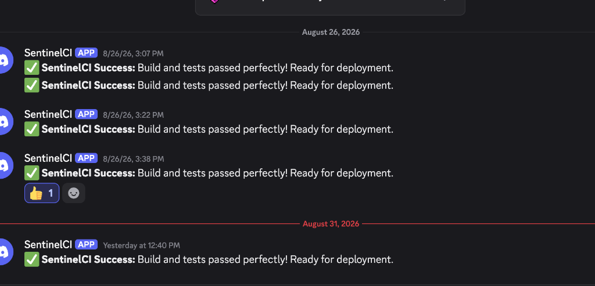
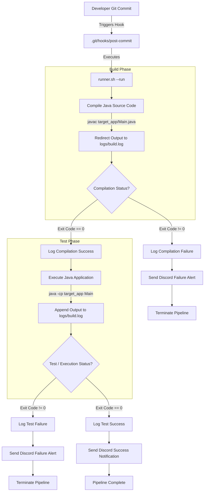

<div align="center">

# 🛡️ SentinelCI

**Lightweight, Zero-Dependency Continuous Integration Orchestration Engine**

*Automate builds, Java compilation, test execution, and real-time Discord status alerts locally via Git Hooks.*

[](https://www.gnu.org/software/bash/)
[](https://www.oracle.com/java/)
[](https://git-scm.com/)
[](https://discord.com/)
[](https://curl.se/)
[](LICENSE)

</div>

---

## 🔔 Live Triggered Notifications

SentinelCI automatically detects repository commits, executes your build and test suites, and immediately broadcasts status reports straight to your Discord channels:

<div align="center">



*_Real-time Discord notification alerts dispatched upon automated pipeline execution post-commit._*

</div>

---

## 🚀 Technical Overview

SentinelCI acts as a local build and integration agent that detects repository commits, compiles source files, runs automated test suites, records build outputs into centralized logs, and dispatches real-time status alerts via HTTP webhooks.

### ✨ Key Capabilities

- ⚡ **Event-Driven Execution**: Triggered automatically on code commit via Git `post-commit` hooks.
- ☕ **Automated Java Build Pipeline**: Compiles source code seamlessly using `javac`.
- 🧪 **Automated Test Suite Runner**: Executes target applications and validates runtime behavior.
- 🛡️ **Failure Trapping**: Captures non-zero exit codes at each stage to prevent broken deployments.
- 📝 **Centralized Build Logging**: Full stdout and stderr captured in `logs/build.log`.
- 💬 **Discord Webhook Alerts**: Real-time rich notifications sent for build success and failure events.
- 🎛️ **CLI Support**: Command-line flag parsing (`--run`, `--help`) for manual execution.

---

## 🏗️ CI/CD Pipeline Architecture

The following diagram illustrates the complete lifecycle of a build and test pipeline managed by SentinelCI upon git commit:



---

## 📁 Repository Structure

```
SentinelCI/
├── .git/
│   └── hooks/
│       └── post-commit      # Git hook script that triggers SentinelCI on commit
├── assets/
│   └── discord_notification.png # Live execution screenshot
├── target_app/
│   ├── Main.java            # Target Java application source file
│   └── Main.class           # Compiled Java bytecode
├── logs/
│   └── build.log            # Aggregated build and test output log file
├── runner.sh                # Main pipeline orchestrator script
├── .gitignore               # Git ignore directives
└── README.md                # Project documentation
```

---

## 🧩 Component Details

### 1. Orchestration Engine (`runner.sh`)
The core Bash script responsible for pipeline execution. It accepts command-line arguments and manages pipeline state:
- `--help`: Displays CLI usage guidelines.
- `--run`: Executes the sequential build, test, logging, and notification sequence.

### 2. Trigger Mechanism (`.git/hooks/post-commit`)
An executable Git hook located in `.git/hooks/`. Upon successful execution of `git commit`, the hook automatically wakes SentinelCI and runs `./runner.sh --run`.

### 3. Build & Test Target (`target_app/Main.java`)
A Java application evaluated by the pipeline. The runner script compiles `Main.java` and executes `Main` with test parameters.

### 4. Logging System (`logs/build.log`)
Captured output from standard output (`stdout`) and standard error (`stderr`) streams during compilation and execution phases.

### 5. Webhook Integration
HTTP POST integration using `curl` to transmit JSON notifications to Discord channels upon build success or failure.

---

## 🛠️ Prerequisites

Ensure the following tools are installed on your host system:

- **Bash** 4.0+
- **Java Development Kit** (JDK 8 or higher)
- **cURL** (for sending webhook notifications)
- **Git**

---

## ⚙️ Installation & Setup

1. **Clone the repository:**
   ```bash
   git clone https://github.com/your-username/SentinelCI.git
   cd SentinelCI
   ```

2. **Make the orchestrator script executable:**
   ```bash
   chmod +x runner.sh
   ```

3. **Configure the Git post-commit hook:**
   ```bash
   chmod +x .git/hooks/post-commit
   ```

   If creating the hook manually, ensure `.git/hooks/post-commit` contains:
   ```bash
   #!/bin/bash
   echo "Git Commit Detected! Executing SentinelCI..."
   ./runner.sh --run
   ```

---

## 💻 Usage

### Automated Execution (Git Trigger)

Commit changes to the repository:
```bash
git add .
git commit -m "feat: updated core application logic"
```

SentinelCI will trigger automatically post-commit and output build results to stdout and `logs/build.log`.

### Manual Execution (CLI)

Run the pipeline manually using the CLI runner:
```bash
./runner.sh --run
```

View command options:
```bash
./runner.sh --help
```

---

## 📊 Log Inspection

Build details, stack traces, and compilation outputs are saved to `logs/build.log`:

```bash
cat logs/build.log
```

---

## 📜 License

This project is open-source and available under the [MIT License](LICENSE).

