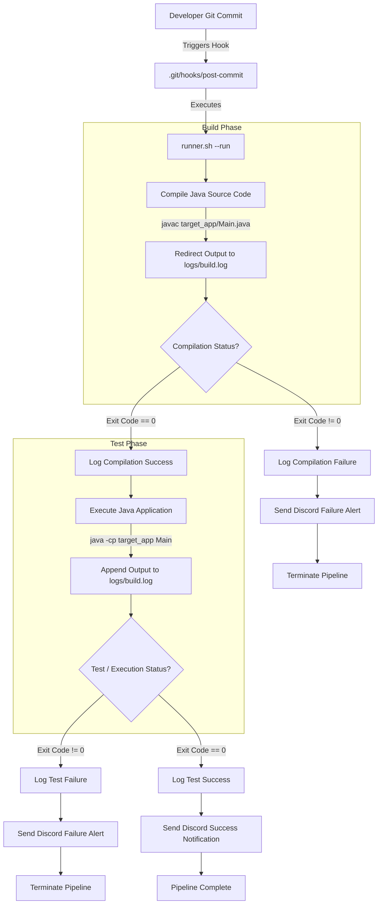

# SentinelCI

SentinelCI is a lightweight, custom Continuous Integration (CI) orchestration runner implemented in Bash. It automates software build, compilation, test execution, and notification workflows locally using Git Hooks.

---

## Technical Overview

SentinelCI acts as a local build and integration agent that detects repository commits, compiles source files, runs automated test suites, records build outputs into centralized logs, and dispatches real-time status alerts via HTTP webhooks.

### Key Capabilities

- Event-driven pipeline execution triggered automatically by Git hooks (`post-commit`).
- Automated compilation stage supporting Java source files via `javac`.
- Automated testing and runtime evaluation phase via `java`.
- Non-zero exit code validation and failure trapping at each pipeline stage.
- Centralized build logging and error capture stored in `logs/build.log`.
- Real-time HTTP webhook notifications sent to Discord channels.
- Command-line interface with flag parsing (`--run`, `--help`).

---

## CI/CD Pipeline Architecture

The following diagram illustrates the lifecycle of a build and test pipeline managed by SentinelCI upon code commit:



---

## Repository Structure

```
SentinelCI/
├── .git/
│   └── hooks/
│       └── post-commit      # Git hook script that triggers SentinelCI on commit
├── target_app/
│   ├── Main.java            # Target Java application source file
│   └── Main.class           # Compiled Java bytecode
├── logs/
│   └── build.log            # Aggregated build and test output log file
├── runner.sh                # Main pipeline orchestrator script
├── .gitignore               # Git ignore directives
└── README.md                # Project documentation
```

---

## Component Details

### 1. Orchestration Engine (`runner.sh`)
The core Bash script responsible for pipeline execution. It accepts command-line arguments and manages pipeline state:
- `--help`: Displays CLI usage guidelines.
- `--run`: Executes the sequential build, test, logging, and notification sequence.

### 2. Trigger Mechanism (`.git/hooks/post-commit`)
An executable Git hook located in `.git/hooks/`. Upon successful execution of `git commit`, the hook automatically wakes SentinelCI and runs `./runner.sh --run`.

### 3. Build & Test Target (`target_app/Main.java`)
A Java application evaluated by the pipeline. The runner script compiles `Main.java` and executes `Main` with test parameters.

### 4. Logging System (`logs/build.log`)
Captured output from standard output (stdout) and standard error (stderr) streams during compilation and execution phases.

### 5. Webhook Integration
HTTP POST integration using `curl` to transmit JSON notifications to Discord channels upon build success or failure.

---

## Prerequisites

Ensure the following tools are installed on your host system:

- Bash 4.0+
- Java Development Kit (JDK 8 or higher)
- cURL (for sending webhook notifications)
- Git

---

## Installation & Setup

1. Clone the repository:
   ```bash
   git clone https://github.com/your-username/SentinelCI.git
   cd SentinelCI
   ```

2. Make the orchestrator script executable:
   ```bash
   chmod +x runner.sh
   ```

3. Configure the Git post-commit hook:
   ```bash
   chmod +x .git/hooks/post-commit
   ```

   If creating the hook manually, ensure `.git/hooks/post-commit` contains:
   ```bash
   #!/bin/bash
   echo "Git Commit Detected! Executing SentinelCI..."
   ./runner.sh --run
   ```

---

## Usage

### Automated Execution (Git Trigger)

Commit changes to the repository:
```bash
git add .
git commit -m "feat: updated core application logic"
```

SentinelCI will trigger automatically post-commit and output build results to stdout and `logs/build.log`.

### Manual Execution (CLI)

Run the pipeline manually using the CLI runner:
```bash
./runner.sh --run
```

View command options:
```bash
./runner.sh --help
```

---

## Log Inspection

Build details, stack traces, and compilation outputs are saved to `logs/build.log`:

```bash
cat logs/build.log
```

---

## License

This project is open-source and available under the [MIT License](LICENSE).
